# Labo 3 - ARN
- Group : Bleuer Rémy, Duruz Florian
- Class : B
- Date  : 20.03.2026

## First experience

### Pretreatment
We chose the 25 lowest frequencies going from 1Hz to 25Hz, they cover all EEG bands that are relevent for sleep calssification. Frequencies that are higher carry only little discriminative infos for this task.

Using the `StandardScaler` centers each of the 25 features to mean 0 and std 1, thus stabilizing and speeding up training.

### Architecture
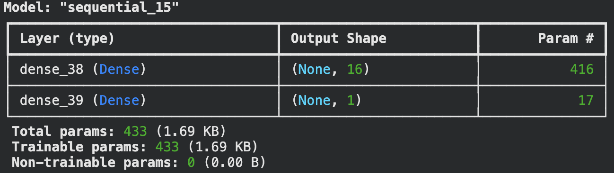

We only use one hidden layer with 16 neurones as we only have 25 inputs to treat. Adding hidden layers and neurones would risk overfitting without having any benefits. The sigmoid output produces a probability between 0 and 1, and the threshold of 0.5 determines the predicted class. We also added a momentum of 0.9 so we avoid getting stuck in a local minima and speed up convergeance. And finaly, the learning rate of 0.01 is pretty standard, but we don't want it to be too high or too low as it could cause losses to the convergeance and slow down the training.

### Training history
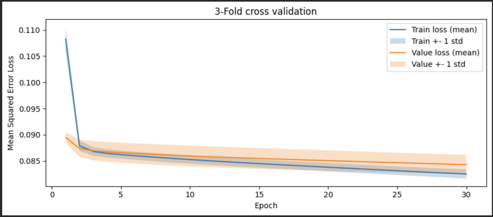

Both `train_loss` and `val_loss` drop pretty drastically ine the first two epochs and the decrease slowly and steadily at the same time. They converge around 0.084. There is no visible overfitting as the two curves remaing close during the training and `val_loss` never increases.

### Performance
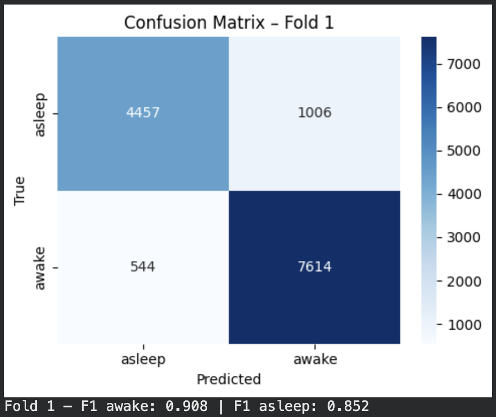
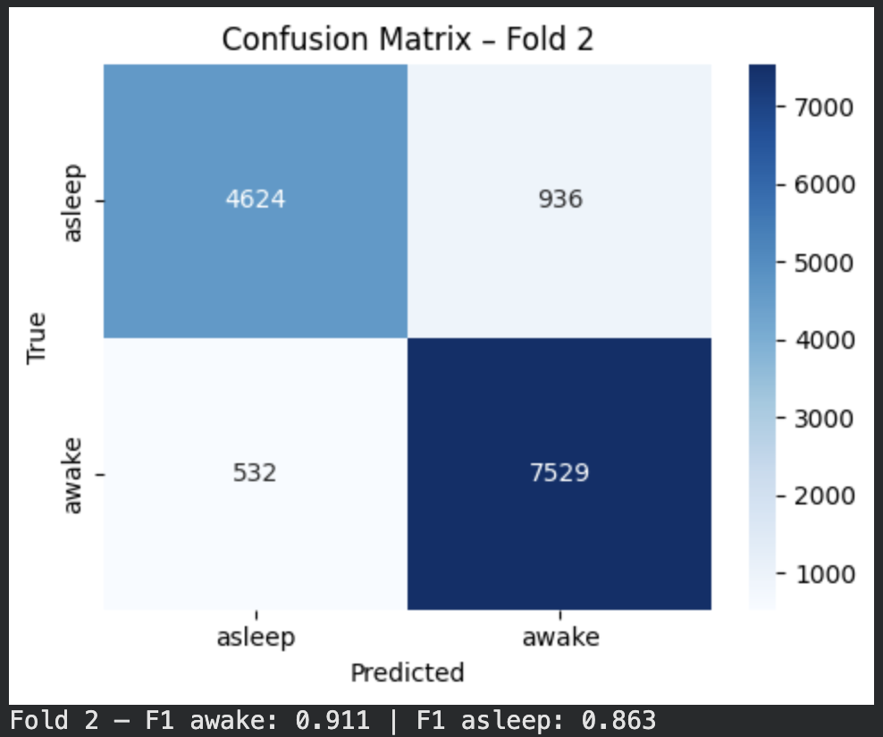
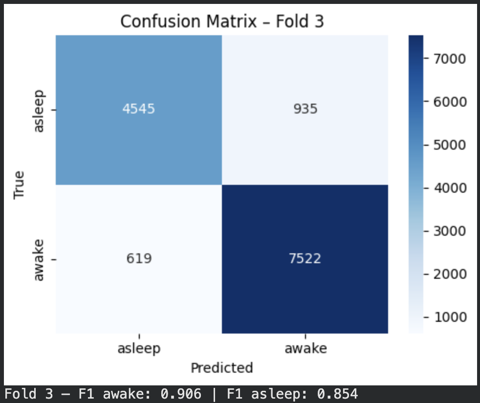
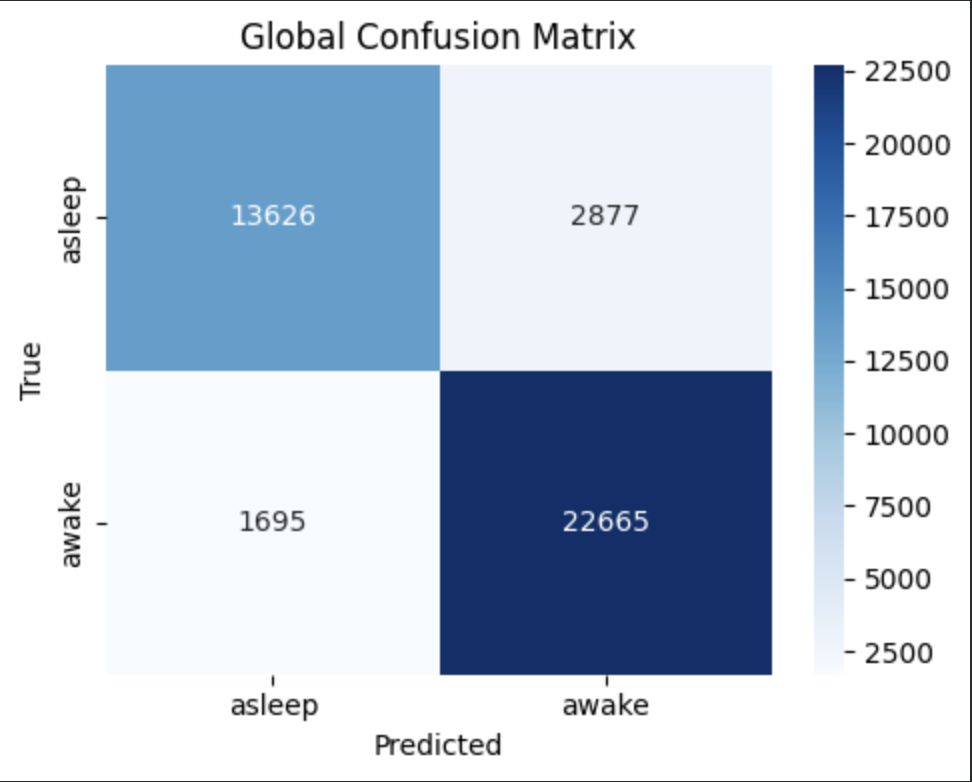

The accuracy is as follows : (13626 + 22665) / 40863 = 88.8%. With this result, we can affirm that the model correctly classifies the large majority of samples in both classes. The error that is mostly present is when the model predicts `awake` when the mouse is actually `asleep` (2877 cases), it is not completly absurd as the light n-rem has EEG patterns that are similar to `awake` state. Here is the F1 score for each class and each fold:

| Fold | F1 awake | F1 asleep | F1 micro |
|------|----------|-----------|----------|
| 1    | 0.908    | 0.852     | 0.886    |
| 2    | 0.911    | 0.863     | 0.892    |
| 3    | 0.906    | 0.854     | 0.886    |

## Second experiment

### Pretreatment
Same as the first experiment, we chose the 25 lowest frequencies from 1Hz to 25Hz. The `StandardScaler` centers each feature to mean 0 and std 1. Since we now have 3 classes, the labels are encoded using `OneHotEncoder` which produces a one-hot vector per sample (e.g. `[1,0,0]` for rem, `[0,1,0]` for n-rem, `[0,0,1]` for awake).

### Architecture
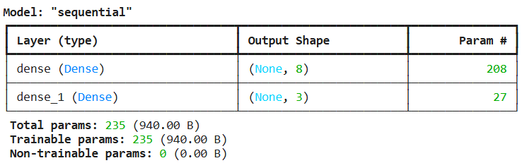

Compared to the first experiment, the main changes are:
- **3 output neurons** instead of 1, one per class (rem, n-rem, awake)
- **Softmax** activation instead of sigmoid, each output represents a probability and the three sum to 1
- **Categorical crossentropy** loss instead of MSE, which is more appropriate for multi-class classification

The predicted class is determined by `argmax` of the output vector, which avoids the ambiguity of a threshold (with sigmoid or tanh, multiple classes or no class could be predicted simultaneously).

We kept the same single hidden layer with 8 neurons, the same learning rate of 0.001 and momentum of 0.99.

### Training history
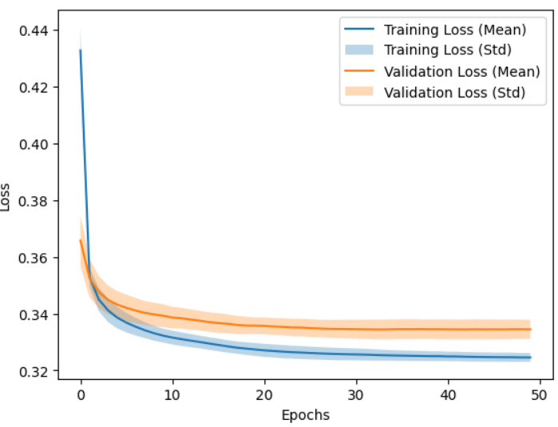

Both `train_loss` and `val_loss` drop sharply in the first few epochs then decrease slowly and steadily. They converge around 0.32-0.34. The validation loss is slightly higher than the training loss but remains close throughout training, indicating no significant overfitting. The std bands are narrow which shows consistent behaviour across the 3 folds.

### Performance
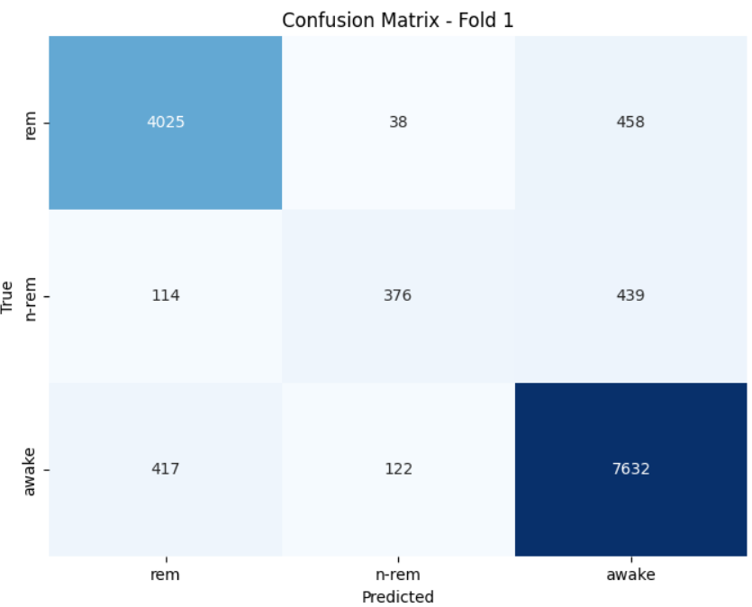
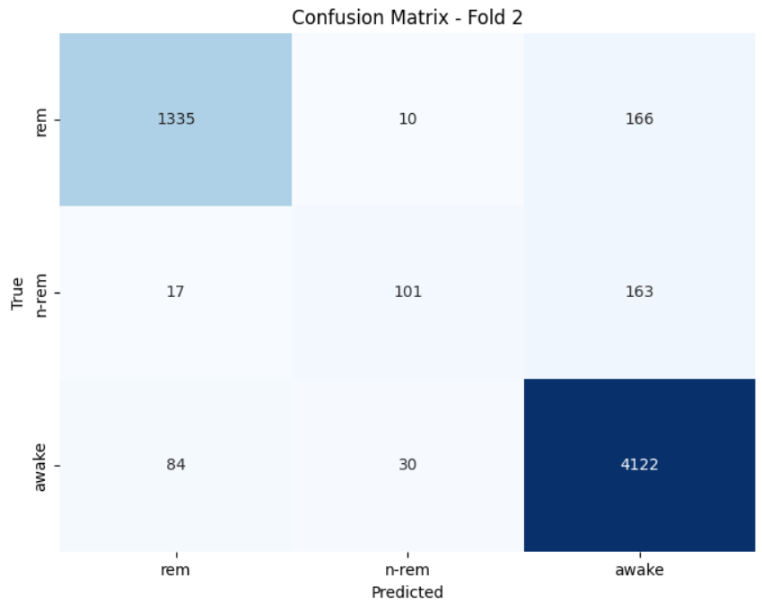
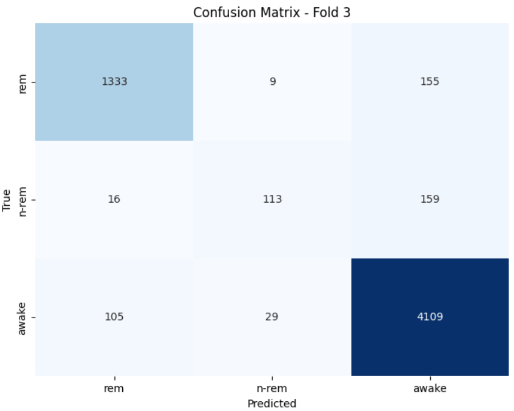
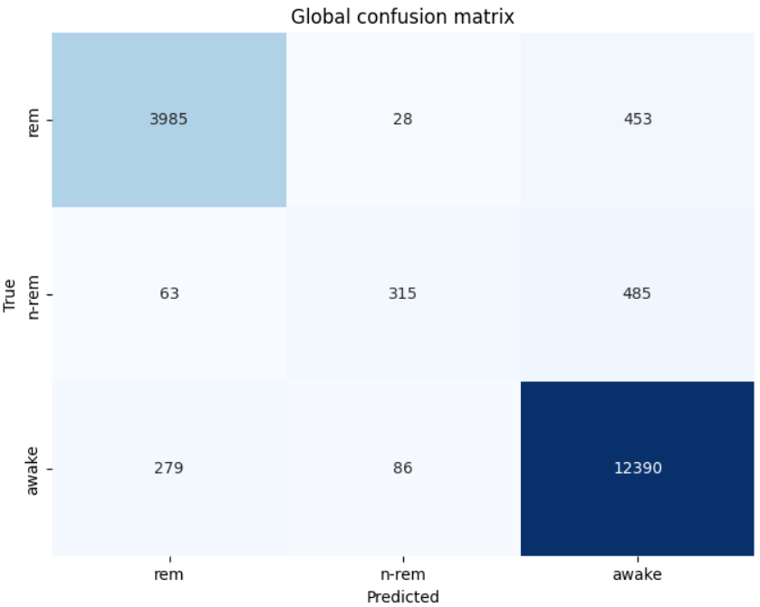

The model performs well on **rem** and **awake** which are the most represented classes. However, **n-rem** is the most confused class, out of 2839 total n-rem samples, only 1094 are correctly classified. It is frequently misclassified as awake (1406 cases) or rem (339 cases). This is expected as n-rem shares EEG characteristics with both other states, especially light n-rem which resembles the awake state.

| Fold | F1 rem | F1 n-rem | F1 awake | F1 micro |
|------|--------|----------|----------|----------|
| 1    | 0.887  | 0.513    | 0.914    | 0.883    |
| 2    | 0.884  | 0.509    | 0.912    | 0.881    |
| 3    | 0.888  | 0.487    | 0.915    | 0.884    |

The micro F1 score around **0.88** confirms that the model generalizes well on rem and awake, but struggles with n-rem which brings the overall score down.

## Competition
 
## Overview
 
The goal of this competition is to classify EEG recordings of mice into three sleep stages: Awake, N-REM, and REM. The model is evaluated using the **macro F1-score** on the test set.
 
Starting from the Experiment 2 architecture, we implemented one targeted improvement: **replacing the SGD optimizer with Adam**. The rest of the model and preprocessing pipeline remains unchanged.
 
## Implemented Idea: Adam Optimizer
 
### Motivation
 
The original model used SGD (Stochastic Gradient Descent) with a fixed learning rate of 0.001 and momentum of 0.99. While SGD can work well, it applies the same learning rate to all parameters and can be slow to converge, especially when the loss surface is uneven across dimensions.
 
Adam (Adaptive Moment Estimation) was chosen as the single improvement because it addresses these limitations directly.

### How Adam Works
 
Adam keeps a running estimate of two quantities for each parameter:
 
- **First moment** (mean of past gradients) : gives momentum to the update
- **Second moment** (variance of past gradients) : scales the step size per parameter
 
This means parameters with small gradients get larger updates, and parameters with large gradients get smaller updates, the optimizer self-adjusts. The update rule is:
```
theta = theta - lr * m_hat / (sqrt(v_hat) + epsilon)
```