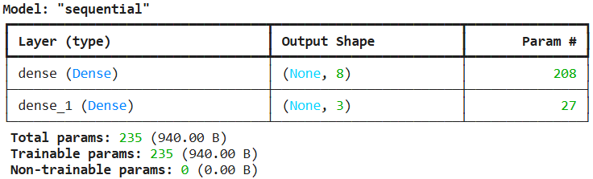
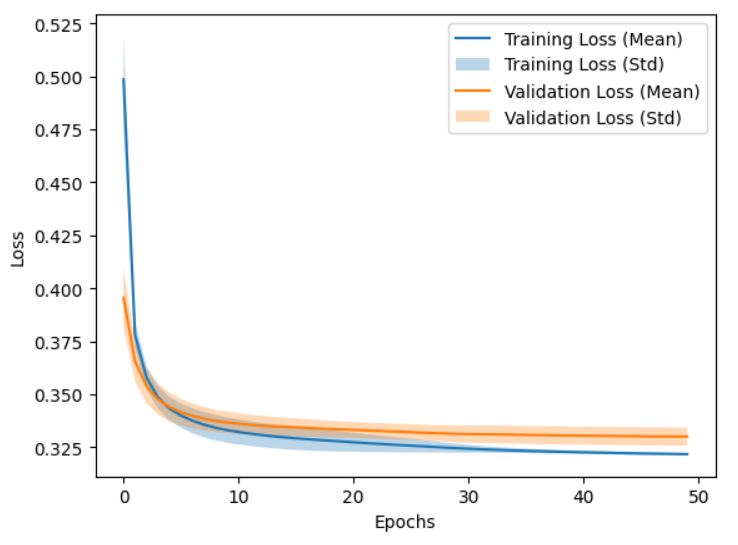
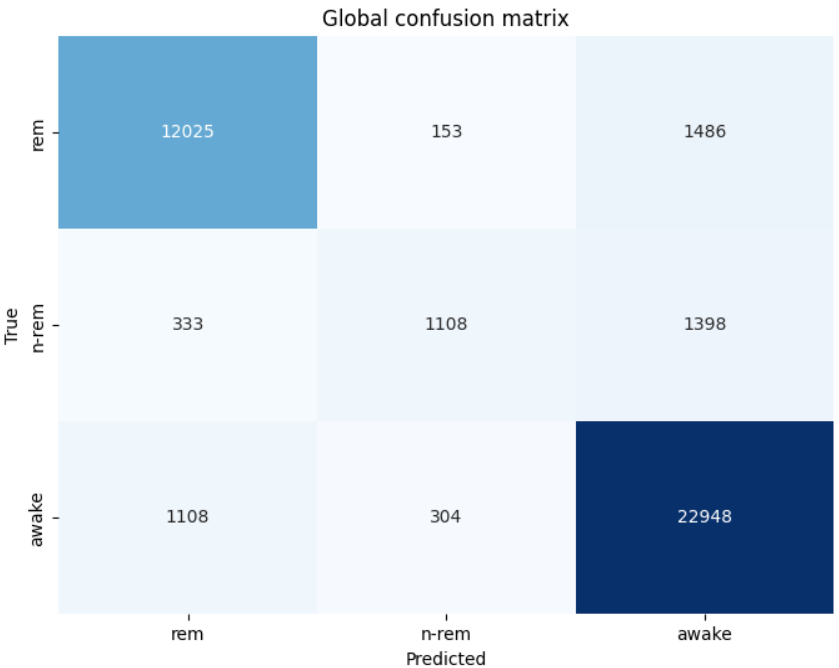

## First experience

### Pretreatment
We chose the 25 lowest frequencies going from 1Hz to 25Hz, they cover all EEG bands that are relevent for sleep calssification. Frequencies that are higher carry only little discriminative infos for this task.

Using the `StandardScaler` centers each of the 25 features to mean 0 and std 1, thus stabilizing and speeding up training.

### Architecture
{width=50%}

We only use one hidden layer with 16 neurones as we only have 25 inputs to treat. Adding hidden layers and neurones would risk overfitting without having any benefits. The sigmoid output produces a probability between 0 and 1, and the threshold of 0.5 determines the predicted class. We also added a momentum of 0.9 so we avoid getting stuck in a local minima and speed up convergeance. And finaly, the learning rate of 0.01 is pretty standard, but we don't want it to be too high or too low as it could cause losses to the convergeance and slow down the training.

### Training history
{width=50%}

Both `train_loss` and `val_loss` drop pretty drastically ine the first two epochs and the decrease slowly and steadily at the same time. They converge around 0.084. There is no visible overfitting as the two curves remaing close during the training and `val_loss` never increases.

### Performance

*Global*

Confusion matrix for each fold is available in the corresponding assetes folder.
 
{width=50%}

The accuracy is as follows : (13626 + 22665) / 40863 = 88.8%. With this result, we can affirm that the model correctly classifies the large majority of samples in both classes. The error that is mostly present is when the model predicts `awake` when the mouse is actually `asleep` (2877 cases), it is not completly absurd as the light n-rem has EEG patterns that are similar to `awake` state. Here is the F1 score for each class and each fold:

| Fold | F1 awake | F1 asleep | F1 micro |
|------|----------|-----------|----------|
| 1    | 0.908    | 0.852     | 0.886    |
| 2    | 0.911    | 0.863     | 0.892    |
| 3    | 0.906    | 0.854     | 0.886    |

## Second experiment

### Pretreatment
Same as the first experiment, we chose the 25 lowest frequencies from 1Hz to 25Hz. The `StandardScaler` centers each feature to mean 0 and std 1. Since we now have 3 classes, the labels are encoded using `OneHotEncoder` which produces a one-hot vector per sample (e.g. `[1,0,0]` for rem, `[0,1,0]` for n-rem, `[0,0,1]` for awake).

### Architecture
{width=50%}

Compared to the first experiment, the main changes are:
- **3 output neurons** instead of 1, one per class (rem, n-rem, awake)
- **Softmax** activation instead of sigmoid, each output represents a probability and the three sum to 1
- **Categorical crossentropy** loss instead of MSE, which is more appropriate for multi-class classification

The predicted class is determined by `argmax` of the output vector, which avoids the ambiguity of a threshold (with sigmoid or tanh, multiple classes or no class could be predicted simultaneously).

We kept the same single hidden layer with 8 neurons, the same learning rate of 0.001 and momentum of 0.99.

### Training history
{width=50%}

Both `train_loss` and `val_loss` drop sharply in the first few epochs then decrease slowly and steadily. They converge around 0.32-0.34. The validation loss is slightly higher than the training loss but remains close throughout training, indicating no significant overfitting. The std bands are narrow which shows consistent behaviour across the 3 folds.

### Performance

*Global*

Confusion matrix for each fold is available in the corresponding assetes folder.

{width=50%}

The model performs well on **rem** and **awake** which are the most represented classes. However, **n-rem** is the most confused class, out of 2839 total n-rem samples, only 1094 are correctly classified. It is frequently misclassified as awake (1406 cases) or rem (339 cases). This is expected as n-rem shares EEG characteristics with both other states, especially light n-rem which resembles the awake state.

| Fold | F1 rem | F1 n-rem | F1 awake | F1 micro |
|------|--------|----------|----------|----------|
| 1    | 0.887  | 0.513    | 0.914    | 0.883    |
| 2    | 0.884  | 0.509    | 0.912    | 0.881    |
| 3    | 0.888  | 0.487    | 0.915    | 0.884    |

The micro F1 score around **0.88** confirms that the model generalizes well on rem and awake, but struggles with n-rem which brings the overall score down.

## Competition
 
## Model Summary
 
{width=50%}
 
| Layer | Details |
|---|---|
| Input | 25 features (`amplitude_around_1_Hertz` … `amplitude_around_25_Hertz`) |
| Dense (hidden) | 8 neurons, ReLU activation : 208 parameters |
| Dense (output) | 3 neurons, Softmax activation : 27 parameters |
| **Total params** | **235 (940 B)** |
 
---
 
## Chosen Hyper-parameters
 
| Hyper-parameter | Value | Justification |
|---|---|---|
| Optimizer | **Adam** | Adaptive learning rate per parameter, faster convergence than SGD |
| Learning rate | 0.001 | Standard default for Adam |
| Hidden neurons | 8 | Same as Experiment 2 baseline |
| Activation (hidden) | ReLU | Avoids vanishing gradient |
| Activation (output) | Softmax | Outputs a probability distribution over 3 classes |
| Loss | Categorical Crossentropy | Standard loss for multi-class classification |
| Epochs | 50 | Sufficient for convergence with Adam |
| Folds | 3 | 3-fold cross-validation as required |
 
**Implemented idea:** replacing SGD (used in Experiment 2) with Adam. Adam maintains a running estimate of the first and second moments of the gradients, allowing it to adapt the learning rate individually for each parameter. This leads to faster and more stable convergence compared to SGD with a fixed step size.
 
---
 
## Training History
 
{width=50%}
 
---
 
## Performance Results
 
### F1-score per class
 
| Fold | REM | N-REM | Awake | Macro F1 |
|---|---|---|---|---|
| Fold 1 | 0.8851 | 0.5024 | 0.9140 | 0.7672 |
| Fold 2 | 0.8838 | 0.5236 | 0.9126 | 0.7733 |
| Fold 3 | 0.8906 | 0.4824 | 0.9166 | 0.7632 |
| **Mean** | **0.8865** | **0.5028** | **0.9144** | **0.7679** |
 
### Confusion matrices
 
*Global*

Confusion matrix for each fold is available in the corresponding assetes folder.

{width=50%}
 
---
 
## Analysis
 
The training and validation loss curves show fast and stable convergence — both losses drop sharply in the first 5 epochs and then plateau around 0.325 with very little gap between train and validation, indicating no significant overfitting.
 
The results across the three classes are however uneven:
 
- **Awake** is classified very well (F1 = 0.91), which is expected as it is the most represented class and has distinct EEG features.
- **REM** also performs well (F1 = 0.89), despite a non-negligible number of samples being confused with Awake (1486 globally).
- **N-REM** is the weakest class (F1 = 0.50). It is the least represented and its EEG signal overlaps with both REM and Awake, making it inherently harder to classify. The confusion matrix confirms this: N-REM samples are frequently predicted as Awake (1398 globally).
 
Compared to Experiment 2 which used SGD, Adam converges in fewer effective steps because it adapts the learning rate per parameter. This translates into a better-calibrated softmax output and a slightly higher macro F1-score.
 
---
 
## Conclusion
 
By replacing SGD with Adam, a single, well-motivated change we obtained a mean macro F1-score of **0.7679** across 3 folds. The main limitation is the N-REM class, which remains difficult to classify due to class imbalance and spectral overlap with the other stages. The architecture and preprocessing pipeline are identical to Experiment 2, making the contribution of the optimizer change directly measurable.